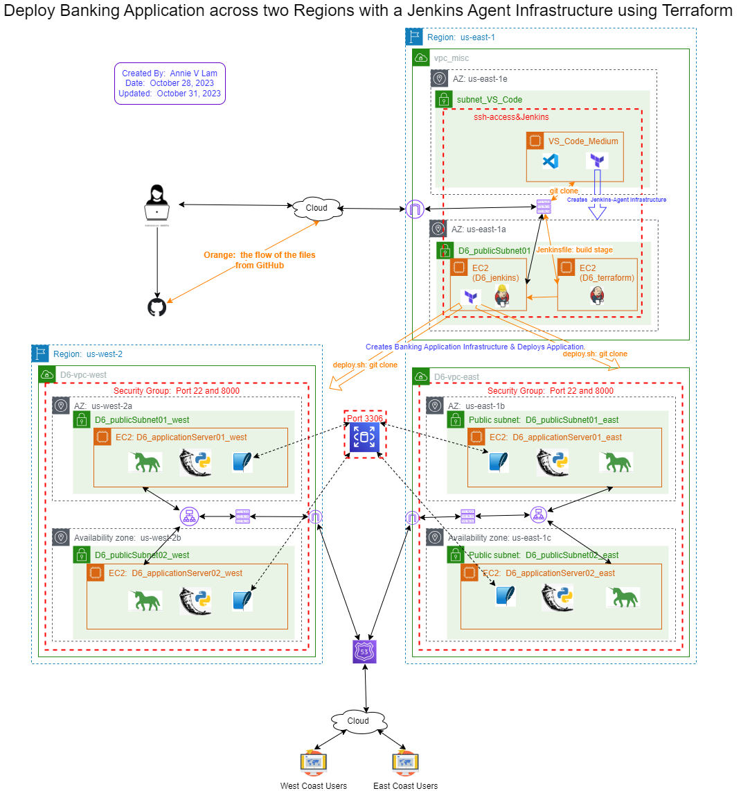

# Run a Jenkins Build for a Banking Application and Deploy it to a second instance using SSH

October 28, 2023

By:  Annie V Lam - Kura Labs

# Purpose

Use Jenkins agent to spin up the main infrastructure and deploy the banking application to for instances.

Previously, we built and tested the application on one server before the Jenkins agent SSHed into a second server to deploy the application.  For this deployment, a Jenkins agent uses Terraform init, plan, and apply the main infrastructure.  In addition, deploy the application.

## Step #1 Diagram the VPC Infrastructure and the CI/CD Pipeline




## Step #2 GitHub/Git

**Setup GitHub Repository for Jenkins Integration:**

GitHub serves as the repository from which Jenkins retrieves files to build, test, and build the infrastructure for the banking application and deploy the banking application.  

In order for the EC2 instance, where Jenkins is installed, to access the repository, you need to generate a token from GitHub and then provide it to the EC2 instance.

[Generate GitHub Token](https://github.com/LamAnnieV/GitHub/blob/main/Generate_GitHub_Token.md)


**GIT - Jenkins Agent Infrastructure**

```
git clone https://github.com/kura-labs-org/LamAnnieV/deploy_6.git
cd deploy_6/
git init
git branch second
git switch second
# Make a new directory jenkinsTerraform
git add jenkinsTerraform
# Create files main.tf, terraform.tfvars, variables.tf, installs1.sh, installs2.sh
terraform init
terraform validate
terraform plan
terraform apply
# After the successful creation of the Jenkins Agent infrastructure
git add main.tf terraform.tfvars variables.tf installs1.sh installs2.sh
git commit -a
#make a file .gitignore and put all the names of the files for git to ignore
git push --set-upstream origin second
git switch main
git merge second
git push --all
```

**GIT - Banking Application Infrastructure**

```
git switch second
#Run Jenkins build
git switch main
# In the directory "initTerraform", create files main.tf, terraform.tfvars, variables.tf, and deploy.sh
terraform init
terraform validate
terraform plan
terraform apply
#After the successful creation of the Application Infrastructure
terraform destroy
git add main.tf terraform.tfvars variables.tf deploy.sh
git commit -a
#make a file .gitignore and put all the names of the files for git to ignore
git switch main
git merge second
git push --all
```

## Step #3 Jenkins

**Jenkins**

Jenkins is used to automate the Build, Test, and Deploy the Banking Application.  To use Jenkins in a new EC2, all the proper installs to use Jenkins and to read the programming language that the application is written in need to be installed. In this case, they are Jenkins, Java, and Jenkins' additional plugin "Pipeline Keep Running Step", which is manually installed through the GUI interface.

**Jenkins Agent Infrastructure**

Use Terraform to spin up the [Jenkins Agent Infrastructure]{jenkinsTerraform/main.tf) to include the installs needed for the [Jenkins instance](jenkinsTerraform/installs1.sh) and the install needed for the [Jenkins agent instance](jenkinsTerraform/installs2.sh), which includes Terraform.

**Setup Jenkins and Jenkins node**

Configure Jenkins

Instructions on how to configure the [Jenkin node](https://github.com/LamAnnieV/Jenkins/blob/main/jenkins_node.md)

Instructions on how to configure [AWS access and secret keys](https://github.com/LamAnnieV/Jenkins/blob/main/AWS_Access_Keys), that the Jenkin node will need to execute Terraform scripts

Instructions on how to install the [Pipleline Keep Running Step](https://github.com/LamAnnieV/Jenkins/blob/main/Install_Pipeline_Keep_Running_Step.md)


## Step #4 Configure Amazon's Relational Database Service(RDS) to manage the MySQL database in all four instances

How to [configure RDS database](https://github.com/LamAnnieV/AWS_RDS_Database/blob/main/Create_AWS_RDS_DB).

Update the section in yellow, green, and blue of the Database endpoint in the following files:  app.py, database.py, and load_data.py


## Step #5 Use Jenkins Agent to execute the Terraform scripts to create the Banking Application Infrastructure

For this application infrastructure, we want:  

```
For each of the Regions (US-east-1 and US-west-2), we want: 
1 VPC
2 Availability Zones
2 Public Subnets
2 EC2 Instances
1 Route Table
1 Security Group with ports 22 and 8000
```
To automate the construction of the banking application infrastructure, the instance with the Jenkins agent and Terraform will execute the Terraform scripts. The [main.tf](Images/main.tf) and [variables.tf](Imaages/variables.tf) files, define the resources to be created and declare variables. Additionally, Terraform enables the execution of a [deploy.sh](initTerraform/deploy.sh) that  includes installing dependencies and deploying the banking application. 

Jenkins Build:  In Jenkins create a build "deploy_6" to run the file Jenkinsfilev for the Banking application from GitHub Repository [https://github.com/LamAnnieV/deploy_6.git](https://github.com/LamAnnieV/deploy_6.git) and run the build.  This build consists of:  The "Build", the "Test", the "Clean", (Terraform) "Init", (Terraform) "Plan", and (Terraform) "Apply" stages.  The "Apply" stage also includes deploying the application.   

## Step #6 Configure Application Load Balancer to distribute the workload

How to configure[ Application Load Balancer](https://github.com/LamAnnieV/AWS_Services/blob/main/Application_Load_Balancer.md)

## Issue(s)

Most of the challenges revolved around the development process, including writing and testing code, identifying bugs, and debugging code within the Terraform files, as well as the edits made in the Jenkinsfiles and setup files

There was an issue with deplying the 'Deploy_5v2' build. In the script, a line is responsible for cloning the repository onto the application server, with the expectation that it replicates the second branch of the repository. Unfortunately, there was an inconsistency observed with the 'home.html' file, located in a subfolder. The cloned 'home.html' file in the application server did not match the version in the second branch of the repository; instead, it reflected the 'main' branch. However, after merging the second branch into the main branch, the launched webpage correctly reflected the changes made to 'home.html'.

## Conclusion

As observed in the CloudWatch images, even when both servers were subjected to 'sudo stress-ng --matrix 1 -t 1m' while simultaneously running Jenkins builds, the CPU usage exceeded 20%, although it remained below 30%. This performance level is adequate as long as the servers are not consistently stressed, do not require more than 2 CPUs, and do not experience a substantial surge in requests. Nonetheless, it's advisable to explore options for additional resources as a precaution.

In this deployment, two instances are employed: one for the Jenkins server and the other server is for the web tier. Both instances are placed in the public subnet, as they need to be accessible via the internet. The Jenkins server is accessible through port 8080 for utilizing the Jenkins GUI interface, while the application server is accessible by our banking customers through port 8000. Thus, both subnets must remain public for these connections to function as required.  However, if we pull out the application tier and database tier into their own server, then that server can be on the private subnet.
  
## Area(s) for Optimization:

-  Enhance automation of the AWS Cloud Infrastructure by implementing Terraform modules.

Note:  ChatGPT was used to enhance the quality and clarity of this documentation
  
